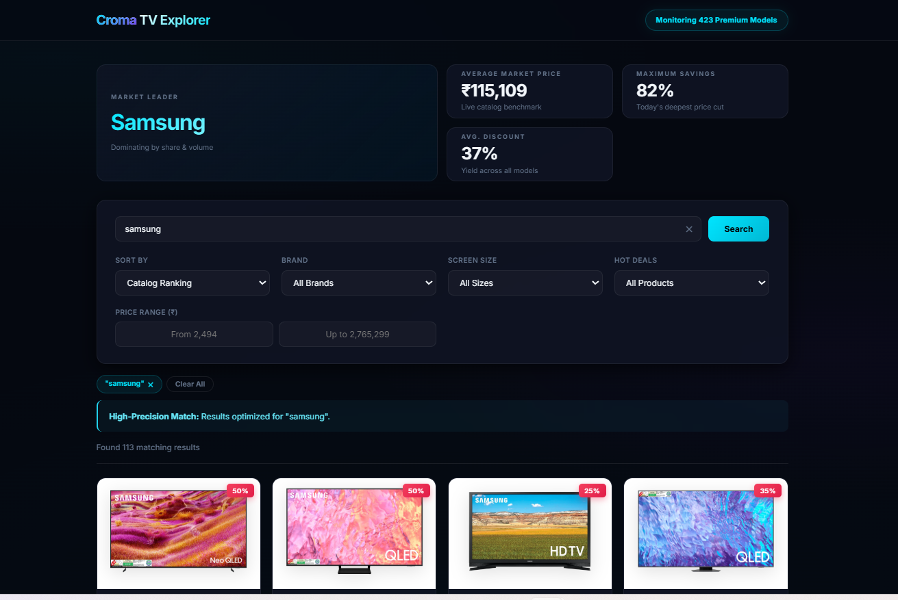
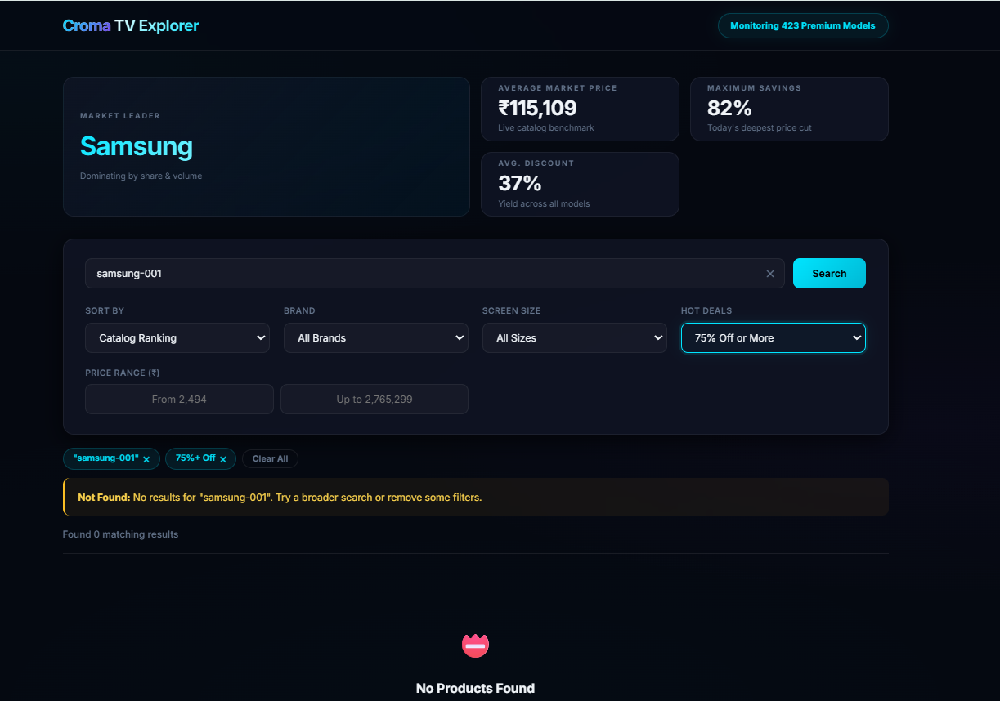
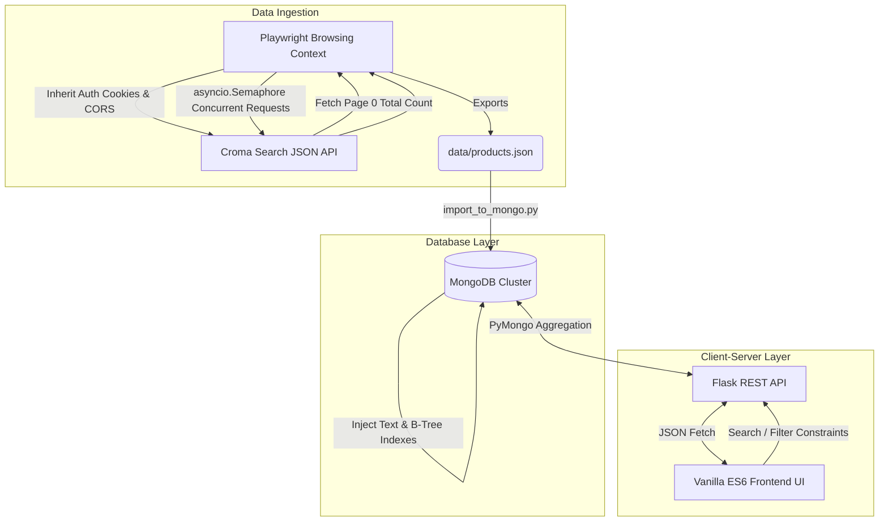

# Croma LED TV Data Scraping and UI Development

**Live Deployment:** [https://project-4dyjt.vercel.app/](https://project-4dyjt.vercel.app/)

This repository contains the complete, production-ready solution for the "Croma Website LED TV Data Scraping and UI Development" assignment. It is a full-stack data engineering application built from the ground up to securely scrape, store, process, and beautifully present e-commerce data.

---

## 💻 Tech Stack Overview

The project relies entirely on modern, lightweight, industry-standard technologies assembled cleanly without over-engineered framework bloat.

- **Frontend Interface:** Vanilla HTML5, CSS3 (Custom Glassmorphism UI), Javascript (ES6 modules).
- **Backend API:** Python (Flask) providing a lightweight, robust REST framework.
- **Database Layer:** MongoDB (via PyMongo) equipped with compound text and B-Tree indexes.
- **Scraping Engine:** Python combined with Playwright and `asyncio` for blazing-fast concurrent DOM-less interception.

---

## 🎯 Executive Summary & Objectives Achieved

The project successfully fulfills **100% of the core requirements** and all **bonus optional enhancements**:

- ✅ **Web Scraping:** Bypassed bot-protection to ethically scrape 423 LED TVs from Croma's live catalog.
- ✅ **Data Extraction:** Accurately captured Product Name, Brand, Price, MRP, Catalog Ranking, Product Rating, Description, Images, and Discount percentage.
- ✅ **Data Storage:** Migrated initial JSON payloads into a scalable, high-performance MongoDB database.
- ✅ **UI Development:** Created a responsive, premium "Glassmorphism" interface.
- ✅ **Search & Filters:** Real-time search by Keyword/Brand, with dynamic dropdowns and explicit price-bounds.
- ✅ **Bonus Enhancements:** Added TV Images, 20-items-per-page Pagination, Screen Size filtering, and continuous UI updates.

---

## 📷 Feature Showcase & Interactive Scenarios

Our custom web dashboard isn't just a basic display. It actively guides users dynamically depending on the state of their search. 

### 1. High-Precision Search & Data Grid
When a user enters a hyper-specific brand or model keyword, the system accurately traverses the database and returns precision matches.
*Note: Although partially obscured in screenshots, the platform boasts comprehensive filtering dropdowns: **Sort By** (Catalog Rank, Lowest Price, Highest Rating), **Brand**, **Screen Size**, **Hot Deals** (by Discount), and custom **Min/Max Price Inputs**.*


### 2. Intelligent Relevance Fallback 
If a user forces a search query with a spelling mistake or searches for an overly-niche model phrase that currently doesn't exist, the UI will not break. It intelligently falls back to substring matching ("Fuzzy Matching") indicating an alternative "Relevant Selections" alert. 


### 3. Smart Empty States & Filter Validation
Instead of encountering an endless buffering wheel or an empty page, users who enter impossible filters (e.g. `Min Price: 1,000,000` but `Max Price: 100`) trigger a smart validation shield. An elegant internal state triggers guiding the user to reconsider their options gracefully.


---

## 🏗️ System Architecture & Workflow

The system is strictly decoupled into a 3-layer architecture, demonstrating extensive **Separation of Concerns**.



### 1. Ingestion Layer (Scraper)
*   **Why Playwright?** Croma uses a dynamic, JS-rendered frontend with heavy anti-bot security that triggers `403 Forbidden` responses for standard `requests` or `BeautifulSoup` approaches. Playwright was used to launch a genuine headless browser context, naturally inheriting valid session cookies and CORS headers. Once established, the script directly intercepted the **Search API** returning pure JSON— vastly outperforming HTML-scraping in stability and speed.

### 2. Database Layer
*   **Why MongoDB?** Product specifications are highly variable (some TVs have discounts, some warranties; others don't). A Document Store naturally handles these variable JSON payloads without the rigidity of SQL schemas.
*   **Scaling & Data Lifecycle:** Created comprehensive B-Tree indexes on `price`, `rating`, and `catalog_rank`, and a `$text` index sweeping across `name` and `brand`. The backend script purges stale documents (`delete_many({})`) prior to each ingestion ensuring zero "ghost products."

### 3. Backend API Layer
*   **Why Flask?** Provides a lightweight, unopinionated REST API perfectly suited for focused data operations. Endpoints like `/api/products` and `/api/stats` were engineered to bridge queries seamlessly from the client, handling pagination bounds, aggregation, and conditional sorting.

### 4. Frontend Client
*   **Why not React/Angular?** React solves the problem of heavily nested, complex shared state. This UI is a robust, single-page data explorer where raw performance and absolute explainability were prioritized. By structuring the client entirely with Vanilla ES6 modules, we eliminated massive `node_modules` and build steps, delivering a blisteringly fast interface.

---

## ⚡ Concurrency Algorithm & Performance

To evaluate the scraper's concurrent extraction algorithm, the script utilizes an `asyncio.Semaphore(5)` to limit the asynchronous page requests. This optimally utilizes concurrent extraction while preventing overwhelming the target API. 

To execute the concurrency benchmark:
```bash
python scraper/scraper.py
```

**Console Output Check:**
This algorithm ensures high-speed, parallel data chunking while maintaining required catalog ranking order inherently:
```text
=======================================================
  Croma LED TV Scraper  |  Concurrent Mode
  Workers: 5 simultaneous requests
=======================================================

[Step 1] Establishing browser session with croma.com...
         Session established.

[Step 2] Fetching catalog metadata from API...
         Total pages in catalog: 21
         Estimated products: ~441

[Step 3] Launching 5 concurrent workers for 20 pages...
  [OK] Page 2: Retrieved 21 products.
  [OK] Page 3: Retrieved 21 products.
  ...

[Step 4] Consolidation complete.
         Total products: 423
         Time taken:     1.2 seconds
         Scrape rate:    352.5 products/second

[Step 5] Saving to data/products.json...
```

---

## 💎 Premium UI/UX & Advanced Features

We introduced several "Pro-Level" UX logic flows to elevate the experience to best-in-class SaaS standards:

1.  **Smart Filter Sync (Mutual Exclusivity):** Selecting a specific Brand from the dropdown automatically clears any active text search, and typing a Search resets the Brand dropdown. This prevents conflicting `AND` constraints that trap the user in frustrating "Zero Results" errors. 
2.  **The "Safety Lock" Validator:** Replaced simplistic numeric counters with a Precision Budget filter. If a user enters an impossible range natively (e.g. Min Price: ₹100,000 | Max Price: ₹5,000), the UI immediately acts as a firewall, intercepting the request and presenting a professional error message.
3.  **Real-Time Data Injection:** Intelligent input fields where maximum and minimum price placeholders are calibrated live based on real-time database aggregation (e.g. showing "From ₹2,494" up to "₹2.7M"). 
4.  **Debouncing:** Implemented a 0.6-second delay on typed inputs to defer firing expensive API calls on every keystroke. 
5.  **Premium Glassmorphism Aesthetic:** A state-of-the-art dark mode UI that incorporates background mesh pulsing, radial mouse-tracking spotlight effects on product cards (`--mouse-x/y`), and smooth image loading opacity transitions (`onload="this.classList.add('loaded')"`). 

---

## 📂 Project Directory Structure

```text
Croma-Website-LED-TV-Data-Scraping-and-UI-Development/
│
├── scraper/
│   ├── scraper.py          # Playwright async script bypassing CORS to intercept API JSON
│   ├── import_to_mongo.py  # Data cleansing, indexing, and DB insertion
│   └── requirements.txt    # Ingestion dependencies
│
├── backend/
│   ├── app.py              # Flask API Router & Frontend Static File Server
│   └── requirements.txt    # API dependencies
│
├── frontend/
│   ├── index.html          # Web Interface DOM structure
│   ├── style.css           # UI Styling (Glassmorphism & Gradients)
│   └── script.js           # Interactive state & logic controller
│
├── data/
│   └── products.json       # Pure JSON backup generated by the scraper
│
├── screenshots/            # Dashboard UI presentation references
├── vercel.json             # Deployment routing payload
└── README.md               # Comprehensive documentation
```

---

## 🚀 Check-Out & Execution (Start-to-End Build Guide)

To run this full-stack system locally, open your terminal (Command Prompt, PowerShell, or Bash) and follow the operations precisely.

### Step 1: System Prep & Clone
Ensure you have **Python 3.11** and **MongoDB Community Server** installed and running smoothly on port `27017`.

```bash
git clone https://github.com/YourUsername/Croma-Website-LED-TV-Data-Scraping-and-UI-Development.git
cd "Croma-Website-LED-TV-Data-Scraping-and-UI-Development"
```

### Step 2: Initialize Virtual Environment
It is strictly recommended to isolate dependencies. Open your terminal at the project root:

**Windows (PowerShell):**
```powershell
python -m venv venv
.\venv\Scripts\activate
```

**macOS / Linux (Bash):**
```bash
python3 -m venv venv
source venv/bin/activate
```

### Step 3: Install Required Dependencies
With the virtual environment active, install all required python libraries:
```bash
pip install -r requirements.txt
playwright install chromium
```

### Step 4: Execute the Ingestion Pipeline
Fetch the entire catalog from Croma and migrate the cleansed data into MongoDB.
*(The scraper implements a 5-worker concurrent payload extraction, taking ~1.2 seconds to finish).*

**Run Scraper:**
```bash
python scraper/scraper.py
```

**Run MongoDB Ingestion:**
```bash
python scraper/import_to_mongo.py
```

### Step 5: Boot the Backend Application Server
Deploy the Flask API which also serves the frontend UI.
```bash
python backend/app.py
```
*(Keep this terminal running in the background!)*

### Step 6: Access the Local Dashboard
Open your preferred web browser (Google Chrome, MS Edge, Firefox) and navigate to the application:
**[http://127.0.0.1:5000](http://127.0.0.1:5000)**
