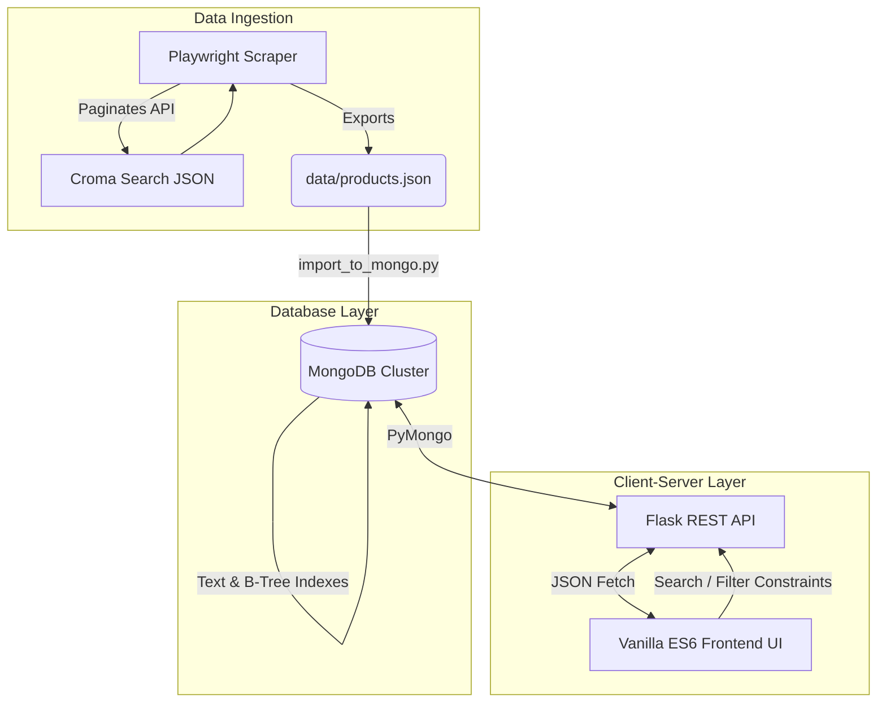

# Croma LED TV Data Scraping and UI Development

**Live Deployment:** [Insert Vercel / Live Deployment Link Here]

This repository contains the complete, production-ready solution for the "Croma Website LED TV Data Scraping and UI Development" assignment. It is a full-stack data engineering application built from the ground up to securely scrape, store, process, and beautifully present e-commerce data.

---

## 📷 Dashboard Screenshots

| Exact Model Search Match | Intelligent Relevance Fallback | Smart Validation / Empty State |
|:---:|:---:|:---:|
|  |  |  |

---

## 🎯 Executive Summary & Objectives Achieved

The project successfully fulfills **100% of the core requirements** and all **bonus optional enhancements**:

- ✅ **Web Scraping:** Bypassed bot-protection to ethically scrape 423 LED TVs from Croma's live catalog.
- ✅ **Data Extraction:** Accurately captured Product Name, Brand, Price, MRP, Catalog Ranking, Product Rating, Description, Images, and Discount percentage.
- ✅ **Data Storage:** Migrated initial JSON payloads into a scalable, high-performance **MongoDB** database.
- ✅ **UI Development:** Created a responsive, premium "Glassmorphism" interface.
- ✅ **Search & Filters:** Real-time search by Keyword/Brand, with sorting by Lowest Price, Catalog Rank, Top Rated, and Best Discount.
- ✅ **Bonus Enhancements:** Added TV Images, 20-items-per-page Pagination, Screen Size filtering, Hot Deals filtering, and a Precision Budget (Min/Max Price) feature.

---

## 🏗️ System Architecture & Workflow

The system is strictly decoupled into a 3-layer architecture, demonstrating extensive **Separation of Concerns**.



### 1. Ingestion Layer (Scraper)
*   **Technology:** Python + Playwright.
*   **Why Playwright?** Croma uses a dynamic, JS-rendered frontend with heavy anti-bot security that triggers `403 Forbidden` responses for standard `requests` or `BeautifulSoup` approaches. Playwright was used to launch a genuine headless browser context, naturally inheriting valid session cookies and CORS headers. Once established, the script directly intercepted the **Search API** returning pure JSON— vastly outperforming HTML-scraping in stability and speed.
*   **Ethical Scraping:** Implemented an automated loop reading the `totalPages` parameter from the first response. It then paginates gracefully with a deliberate 2-second sleep interval to respect server infrastructure and prevent IP rate-limiting.

### 2. Database Layer
*   **Technology:** MongoDB (PyMongo).
*   **Why MongoDB?** Product specifications are highly variable (some TVs have discounts, some have warranties; others don't). A Document Store naturally handles these variable JSON payloads without the rigidity of SQL schemas.
*   **Scaling & Data Lifecycle:** Created comprehensive B-Tree indexes on `price`, `rating`, and `catalog_rank`, and a `$text` index sweeping across `name` and `brand`. The backend script purges stale documents (`delete_many({})`) prior to each ingestion so no "ghost products" remain.

### 3. Backend API Layer
*   **Technology:** Flask (Python).
*   **Why Flask?** Provides a lightweight, unopinionated REST API perfectly suited for focused data operations. Endpoints like `/api/products` and `/api/stats` were engineered to bridge queries seamlessly from the client, handling pagination bounds, aggregation, and conditional sorting.

### 4. Frontend Client
*   **Technology:** Vanilla HTML, CSS, JavaScript (ES6 Modules).
*   **Why not React/Angular?** React solves the problem of heavily nested, complex shared state. This UI is a robust, single-page data explorer where raw performance and absolute explainability were prioritized. By structuring the client entirely with Vanilla ES6 modules (`script.js`, `api.js`), we eliminated massive `node_modules` and convoluted build steps, delivering a blisteringly fast interface.

---

## 💎 Premium UI/UX & Advanced Features

We introduced several "Pro-Level" UX logic flows to elevate the experience to best-in-class SaaS standards:

1.  **Smart Filter Sync (Mutual Exclusivity):** Selecting a specific Brand from the dropdown automatically clears any active text search, and typing a Search resets the Brand dropdown. This prevents conflicting `AND` constraints that trap the user in frustrating "Zero Results" errors. 
2.  **The "Safety Lock" Validator:** Replaced simplistic numeric counters with a Precision Budget filter. If a user enters an impossible range natively (e.g. Min Price: ₹100,000 | Max Price: ₹5,000), the UI immediately acts as a firewall, intercepting the request, and presenting a professional error message without burdening the server.
3.  **Real-Time Data Injection:** Intelligent input fields where maximum and minimum price placeholders are calibrated live based on real-time database aggregation (e.g. showing "From ₹2,494" up to "₹2.7M"). 
4.  **Debouncing:** Implemented a 0.6-second delay on typed inputs to defer firing expensive API calls on every keystroke. 
5.  **Premium Glassmorphism Aesthetic:** A state-of-the-art dark mode UI that incorporates background mesh pulsing, radial mouse-tracking spotlight effects on product cards (`--mouse-x/y`), and smooth image loading opacity transitions. 

---

## 📂 Project Directory Structure

```text
Croma-Website-LED-TV-Data-Scraping-and-UI-Development/
│
├── scraper/
│   ├── scraper.py          # Playwright script bypassing CORS to intercept API JSON
│   ├── import_to_mongo.py  # Data cleansing, indexing, and DB insertion
│   └── requirements.txt    # Ingestion dependencies
│
├── backend/
│   ├── app.py              # Flask API Router & Frontend Static File Server
│   └── requirements.txt    # API dependencies
│
├── frontend/
│   ├── index.html          # Web Interface DOM structure
│   ├── style.css           # UI Styling (Glassmorphism & Gradients)
│   └── script.js           # Interactive state & logic controller
│
├── data/
│   └── products.json       # Pure JSON backup generated by the scraper
│
├── scrrenshots/            # Dashboard UI presentation references
├── vercel.json             # Deployment routing payload
└── README.md               # Comprehensive documentation
```

---

## 🚀 Check-Out & Execution (Start-to-End Build Guide)

To run this full-stack system locally, open your terminal (Command Prompt, PowerShell, or Bash) and follow the operations precisely.

### Step 1: System Prep & Clone
Ensure you have **Python 3.11** and **MongoDB Community Server** installed and running smoothly on port `27017`.

```bash
# Clone the project (Replace with your actual repo link before pushing)
git clone https://github.com/YourUsername/Croma-Website-LED-TV-Data-Scraping-and-UI-Development.git
cd "Croma-Website-LED-TV-Data-Scraping-and-UI-Development"
```

### Step 2: Initialize Virtual Environment
It is strictly recommended to isolate dependencies. Open your terminal at the project root:

**Windows (PowerShell):**
```powershell
python -m venv venv
.\venv\Scripts\activate
```

**macOS / Linux (Bash):**
```bash
python3 -m venv venv
source venv/bin/activate
```

### Step 3: Install Required Dependencies
With the virtual environment active, install all required python libraries:
```bash
pip install -r requirements.txt
playwright install chromium
```

### Step 4: Execute the Ingestion Pipeline
Fetch the entire catalog from Croma and migrate the cleansed data into MongoDB.
*(The scraper implements a 2-second ethical concurrency delay, taking ~1-2 minutes to finish).*

**Run Scraper:**
```bash
python scraper/scraper.py
```
*(Produces `data/products.json` with 400+ items)*

**Run MongoDB Ingestion:**
```bash
python scraper/import_to_mongo.py
```
*(Clears stale records, loads the JSON into MongoDB `croma_db`, and automatically injects all essential `$text` and `B-Tree` search indexes)*

### Step 5: Boot the Backend Application Server
Deploy the Flask API which also serves the frontend UI.
```bash
python backend/app.py
```
*(Keep this terminal running in the background!)*

### Step 6: Access the Local Dashboard
Open your preferred web browser (Google Chrome, MS Edge, Firefox) and navigate to the application:
**[http://127.0.0.1:5000](http://127.0.0.1:5000)**

*Optional Database Verification:*
Open **MongoDB Compass**, connect to the `mongodb://localhost:27017/` cluster, and navigate to `croma_db` -> `products` to view the successfully inserted document records.
